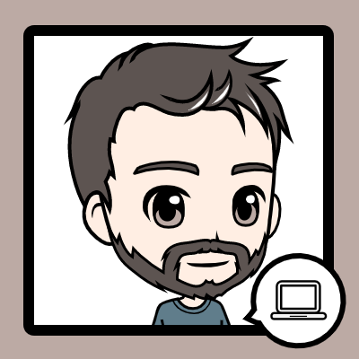

  
  <h1>Olá, eu sou Lucas Almeida &#128075;&#127995;</h1>
  
Sou graduado em engenharia elétrica e atualmente sou estudante de Desenvolvimento Web na escola Trybe.

  <a href="https://github.com/lucas-almeida-sd">
  
  

  

  <h2>Habilidades</h2>
  
  
  
  
  
  
  
  

  

  <h2>Contatos</h2>
  
  
  

